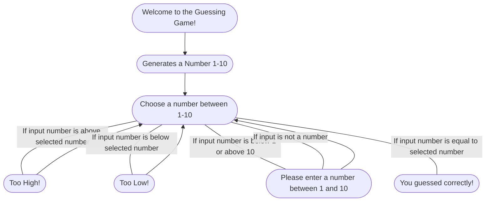

Game begins with an introduction and generates a random number between 1 and 10. 
Asks the user for an input. 
If input is not the selected number it will tell whether the guess was too high or too low. 
If the input was beyond the 1-10 range or was not a number it will ask. 
If the input was correctly the selected number, it will tell that you guessed correctly. 
In all results except success it will ask you again for an input to play until you guess the number. 
